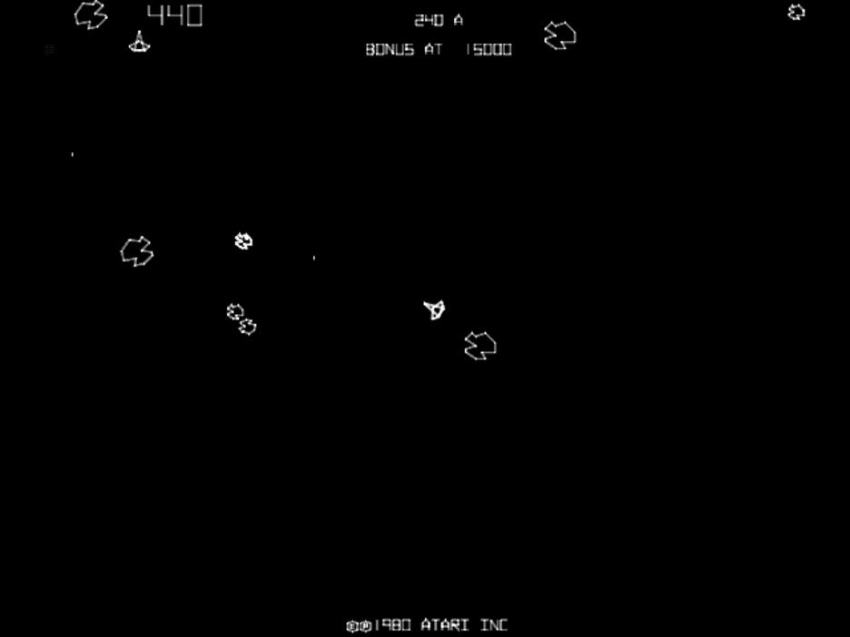
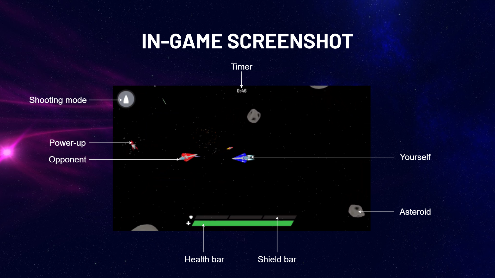
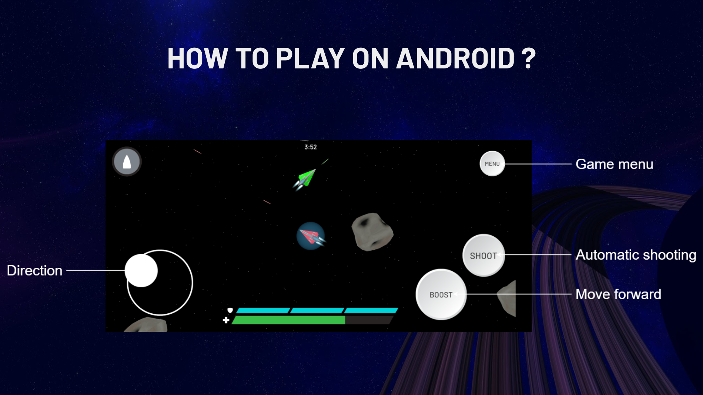

# Astrocket

> Nous avons formé une équipe de 11 étudiants afin de réaliser un projet de développement d’envergure : réimaginer un jeu populaire des années 1980 comme un jeu multijoueur en temps réel, sur PC et mobile.

    

## Le jeu de référence: Asteroids

Nous avons décidé de nous inspirer du jeu *Asteroids*, sorti en 1979 sur Atari 2600 et borne d’arcade. Le but du jeu est de détruire un maximum d’astéroïdes à bord d’un vaisseau spatial afin d’atteindre le score le plus élevé possible. Le vaisseau peut pivoter sur lui-même et se déplacer avec une forte inertie, tout en tirant des projectiles. Le joueur hérite de 3 vies et le jeu se termine lorsqu’il les perd toutes.

    

## Notre adaptation: Astrocket

*Asteroids* devient *Astrocket :* le joueur doit, en plus de survivre face aux astéroïdes, survivre face à d’autres joueurs. Il peut alors tirer sur les vaisseaux de ses adversaires ou sur les astéroïdes pour gagner des points. Le joueur avec le nombre de points le plus élevé gagne la partie. En implémentant un mode multijoueur au jeu *Asteroids*, nous espérons remettre au goût du jour un grand classique du jeu vidéo, et y ajouter la nervosité induite par la compétition entre joueurs.

    

    

Nous conservons l’importance de détruire des astéroïdes, puisque certains d’entre eux permettent de récupérer des “power-ups” afin de prendre l’avantage sur les autres joueurs. Le système de vie a été remanié pour prolonger la durée du combat, ce qui a pour effet de ne pas frustrer le joueur par une mort immédiate, ainsi que de les inciter à être plus actifs.

### Mise en oeuvre

- **1 serveur principal**

    > Python
    >
    - instancie, référence et orchestre les serveurs de jeu
    - instanciation dynamique de nouveaux serveurs de jeu lorsque les autres sont pleins

- **Plusieurs serveurs de jeu**

    > Unity, C#, Mirror Networking
    >
    - assurent le déroulement des parties
    - synchronisent les actions des clients
    - remontent les informations au serveur principal (nombre de joueurs, résultats de partie, etc.)

- **1 base de données et 2 APIs**

    > MariaDB, NodeJS
    >
    - authentification
    - statistiques des joueurs

- **Architecture renforcée**

    > HAProxy, nodemon
    >
    - reverse proxy
    - process manager
- **Moteur de jeu**

    > Unity
    >

## Pour aller plus loin

- [Web site](https://astrocket.netlify.app/)

